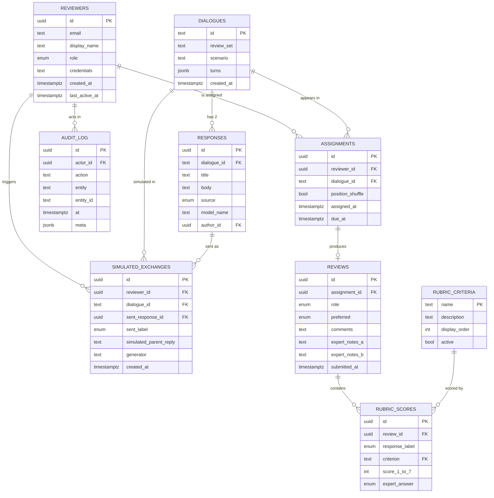

# MIRA — Motivational Interviewing Response Assessment

MIRA is a research review interface for evaluating Motivational Interviewing (MI) dialogue responses. Reviewers are shown a parent concern with two blinded candidate counselor responses (Response A and Response B). Source identity (human interviewer vs Mira) is hidden from reviewers during the task and stored internally for researcher-side analysis. The platform also provides progress tracking for individual reviewers and aggregate analytics across the full reviewer pool.

## Purpose

The project supports the CTSI Mira dialogue review/evaluation workflow, comparing Mira-generated motivational interviewing responses against human-interviewer responses in a blinded study. The interface is designed for two reviewer roles:

- **Parent reviewers** — rate each response on a 7-point agreement scale across appropriateness, harm, clarity, sense-making, responsibility, and empathy.
- **Expert reviewers** — answer yes / no / unsure on medical safety, accuracy, and relevance, with optional safety notes.
- **Researchers** — monitor reviewer progress, inter-rater agreement, preferred-response distributions, and (post-hoc) source comparisons.

Reviewers are **not** asked to guess which response is human vs Mira. Source identification is an optional researcher-only analysis, not a reviewer task.

## Pages

### `/` — Review
The main scoring screen for a single review item.
- Parent Concern + barrier category badge.
- Prior Dialogue Context (expanded by default).
- Side-by-side blinded Response A / Response B cards.
- Role-appropriate rubric (parent 7-point or expert yes/no/unsure + safety notes).
- Preferred response selection (A, B, neither, too similar).
- Free-text reviewer comments.
- Optional Dialogue Preview panel: a "Preview in dialogue context" affordance on each response shows how the response might land with a simulated parent reply. This preview is clearly separated from the review stimulus, is not scored, and uses no live AI.
- Save draft / Submit.

### `/progress` — Progress Tracker
Personal progress view for an individual reviewer across the 35-item review set, grouped by HPV barrier category, with completion status and per-item ratings summary.

### `/dashboard` — Research Dashboard
Aggregate metrics across all parent and expert reviewers: completion, preferred-response distribution, parent rubric means, expert safety/accuracy/relevance pass rates, barrier-category summaries, and export mockups.

## Tech Stack

- **Framework**: TanStack Start (v1) with React 19 and Vite 7.
- **Routing**: File-based routing in `src/routes/` (`__root.tsx`, `index.tsx`, `progress.tsx`, `dashboard.tsx`).
- **Styling**: Tailwind CSS v4 with semantic design tokens defined in `src/styles.css`.
- **UI**: shadcn/ui components (Radix primitives) under `src/components/ui/`.
- **Charts**: Recharts (used on the dashboard).
- **State**: Local React state; mock data only — no backend.

## Project Structure

```
src/
  routes/
    __root.tsx          # Root layout, includes top NavBar + Outlet
    index.tsx           # Review page (/)
    progress.tsx        # Progress Tracker (/progress)
    dashboard.tsx       # Research Dashboard (/dashboard)
  components/
    mira/               # Domain components
      NavBar.tsx              # Top navigation across the three pages
      Header.tsx              # Review page header
      DialogueContext.tsx     # Client utterance context block
      DialogueReview.tsx      # Review page container + state
      ResponseComparison.tsx  # Side-by-side response cards
      ResponseCard.tsx           # Single response card + "Preview in dialogue context"
      DialoguePreviewPanel.tsx   # Optional separated preview area (not scored)
      RubricRating.tsx        # Per-criterion rating controls
      ReviewerComments.tsx    # Free-text comments
      ReviewActions.tsx       # Submit / navigation actions
      ResearchMetadata.tsx
      SubmittedState.tsx
    ui/                 # shadcn/ui primitives
  data/
    dialogues.ts        # Mock dialogue scenarios + rubric criteria
    mockProgress.ts     # Mock per-reviewer progress + aggregate data
  styles.css            # Tailwind v4 + design tokens
  router.tsx            # Router setup
```

## Data Model (mock)

All data is currently mocked in `src/data/`. Key shapes:

- **Dialogue** — client utterance + two candidate responses (A/B) + rubric criteria.
- **DialogueProgress** — per-dialogue review state: completion, selected stronger response, average grades, true source (A/B = human/ai), and reviewer source guesses.
- **Reviewer** — anonymized reviewer with derived metrics: completion %, average grade, source-identification accuracy, picked-human / picked-ai counts.

Helpers `summarizeProgress` and `reviewerAverages` compute the aggregates rendered on the Progress Tracker and Research Dashboard.

## Development

```bash
bun install
bun run dev      # start dev server
bun run build    # production build
bun run lint     # eslint
```

## How it works

The diagram below shows the current mock-data flow (solid lines) alongside how the same flow would operate when wired to a real backend with authenticated users and a randomized dialogue queue (dashed lines).


### From mock to real

- **Dialogues** — replace `src/data/dialogues.ts` with a `dialogues` + `responses` table; the Review page fetches the next assignment via a server function instead of indexing a static array.
- **Randomization** — a sampler assigns each reviewer an unseen, order-randomized pair (Response A/B shuffled per view) so source position can't bias ratings.
- **Users** — add authentication so each reviewer has an identity; reviews are written with `reviewer_id` and progress/dashboard queries scope to the logged-in user (or aggregate across all reviewers for researchers).
- **Submissions** — `ReviewActions` "Submit" calls a server function that writes a `reviews` row (rubric ratings, preferred-response choice, comments) instead of local component state. Reviewers do not submit source guesses.
- **Analytics** — the Research Dashboard reads from aggregation queries/materialized views (completion %, preferred-response distribution, parent rubric means, expert pass rates, inter-rater agreement) instead of `summarizeProgress` over mock arrays. Source comparisons are computed post-hoc from the hidden `responses.source` column.

## Data Model (proposed real backend)

The tables below are what a real backend would persist. Sample rows are illustrative JSON, not literal SQL.

### Schema diagram




### `reviewers`
Authenticated raters and researchers. One row per user account.
| column | type | notes |
|---|---|---|
| `id` | uuid (pk) | |
| `email` | text unique | login identity |
| `display_name` | text | shown in researcher views |
| `role` | enum(`reviewer`,`researcher`,`admin`) | RBAC |
| `credentials` | text | e.g. "LCSW, 8 yrs MI" |
| `created_at` | timestamptz | |
| `last_active_at` | timestamptz | |
```json
{ "id": "r_8f2…", "email": "j.doe@uni.edu", "display_name": "J. Doe",
  "role": "reviewer", "credentials": "LCSW", "last_active_at": "2026-06-08T14:02:11Z" }
```

### `dialogues`
A client utterance scenario. Turns are stored inline as JSON since they're read together.
| column | type | notes |
|---|---|---|
| `id` | text (pk) | e.g. `MIRA-014` |
| `review_set` | text | "Pilot Set B" |
| `scenario` | text | one-line summary |
| `turns` | jsonb | `[{ "speaker": "parent", "text": "…" }]` |
| `created_at` | timestamptz | |
```json
{ "id": "MIRA-014", "review_set": "Pilot Set B",
  "scenario": "Parent uncertain about ADHD medication.",
  "turns": [{ "speaker": "parent", "text": "I just don't know…" }] }
```

### `responses`
Two candidate counselor responses per dialogue. `source` is ground truth; never returned to reviewers.
| column | type | notes |
|---|---|---|
| `id` | uuid (pk) | |
| `dialogue_id` | fk → dialogues | |
| `title` | text | "Response 1" |
| `text` | text | response body |
| `source` | enum(`human`,`ai`) | hidden from reviewers |
| `model_name` | text null | e.g. `gpt-5`, null if human |
| `author_id` | uuid null | fk → clinicians, null if AI |
```json
{ "id": "rsp_…", "dialogue_id": "MIRA-014", "title": "Response 1",
  "text": "It sounds like…", "source": "ai", "model_name": "gpt-5" }
```

### `assignments`
Which dialogues are queued for which reviewer, and how A/B were shuffled.
| column | type | notes |
|---|---|---|
| `id` | uuid (pk) | |
| `reviewer_id` | fk | |
| `dialogue_id` | fk | |
| `position_shuffle` | bool | `true` = response B shown as A |
| `assigned_at` | timestamptz | |
| `due_at` | timestamptz null | |
```json
{ "id": "asg_…", "reviewer_id": "r_8f2…", "dialogue_id": "MIRA-014",
  "position_shuffle": true, "assigned_at": "2026-06-01T09:00:00Z" }
```

### `reviews`
One row per submitted review. Rubric scores live in a child table.
| column | type | notes |
|---|---|---|
| `id` | uuid (pk) | |
| `assignment_id` | fk unique | |
| `selected` | enum(`A`,`B`,`neither`,`too_similar`) | stronger response |
| `guess_a` | enum(`human`,`ai`) null | reviewer's source guess |
| `guess_b` | enum(`human`,`ai`) null | |
| `comments` | text | free-text |
| `submitted_at` | timestamptz | |
```json
{ "id": "rev_…", "assignment_id": "asg_…", "selected": "A",
  "guess_a": "human", "guess_b": "ai", "comments": "A reflects feeling better.",
  "submitted_at": "2026-06-02T17:23:09Z" }
```

### `rubric_scores`
Per-criterion 1–5 score for each response within a review.
| column | type | notes |
|---|---|---|
| `id` | uuid (pk) | |
| `review_id` | fk | |
| `response_label` | enum(`A`,`B`) | |
| `criterion` | text | fk → rubric_criteria.name |
| `score` | int (1–5) | |
```json
{ "review_id": "rev_…", "response_label": "A", "criterion": "Empathy", "score": 5 }
```

### `rubric_criteria`
Editable list of rubric items so researchers can revise without a deploy.
```json
{ "id": "c_emp", "name": "Empathy", "description": "…",
  "display_order": 1, "active": true }
```

### `audit_log`
Append-only trail of edits (re-opening reviews, admin overrides).
```json
{ "actor_id": "r_admin", "action": "review.reopen",
  "entity": "reviews", "entity_id": "rev_…", "at": "2026-06-03T10:00:00Z",
  "meta": { "reason": "Reviewer flagged misclick." } }
```

### `simulated_exchanges`
Optional record of the in-app "Send to dialogue" simulator. When a reviewer clicks **Send to dialogue** on Response A or B, the chosen response is appended to the visible conversation and a simulated parent reply is generated. Only the most recent exchange per (reviewer, dialogue) is kept, so a new send overwrites the previous row.
| column | type | notes |
|---|---|---|
| `id` | uuid (pk) | |
| `reviewer_id` | fk → reviewers | |
| `dialogue_id` | fk → dialogues | |
| `sent_response_id` | fk → responses | which candidate was sent |
| `sent_label` | enum(`A`,`B`) | label as shown to this reviewer (post-shuffle) |
| `simulated_parent_reply` | text | model- or template-generated parent turn |
| `generator` | text | e.g. `template-v1`, `gpt-5-sim` |
| `created_at` | timestamptz | |
```json
{ "id": "sim_…", "reviewer_id": "r_8f2…", "dialogue_id": "MIRA-014",
  "sent_response_id": "rsp_7710", "sent_label": "A",
  "simulated_parent_reply": "Hmm, that actually makes me feel a little better.",
  "generator": "template-v1", "created_at": "2026-06-08T14:05:22Z" }
```

### Randomization & assignment rules

- **Unseen sampling**: each reviewer only ever gets dialogues they haven't reviewed.
- **A/B position shuffle**: `assignments.position_shuffle` randomizes which response appears as A vs B so source position can't bias ratings.
- **Balanced human/AI**: the sampler tries to keep ~50/50 human-A vs human-B across each reviewer's queue.
- **Overlap dialogues**: a configurable subset (e.g. 10 of 100) is assigned to every reviewer so inter-rater agreement can be computed.
- **Simulated exchanges**: not part of the formal review record — they exist only to let reviewers see how a parent might respond. They are excluded from rubric scoring and aggregate metrics.

See the in-app **API Docs** section (`/api-docs`) for the full endpoint surface that would back these tables.

## Notes

- No backend is wired up; all reviewer/dialogue data is mock data for design and prototyping.
- Routes are auto-registered by the TanStack Router Vite plugin — do not edit `src/routeTree.gen.ts` by hand.
- The Progress Tracker intentionally surfaces completed rows first so the design team can preview the populated state.


