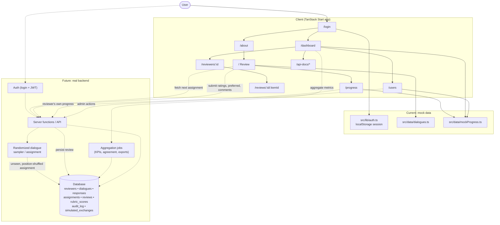
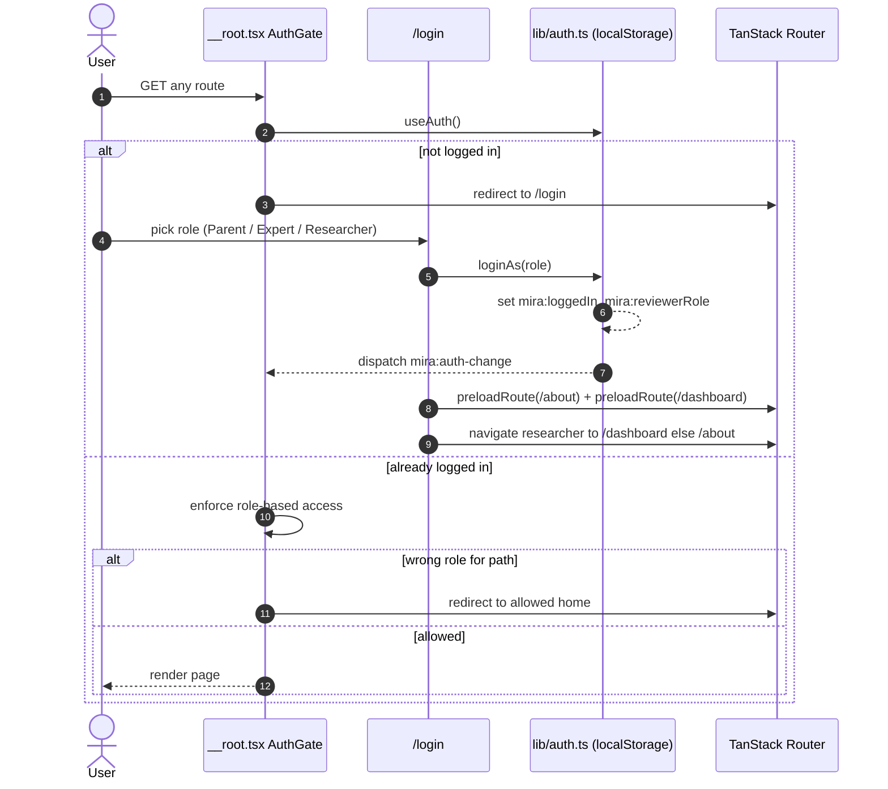
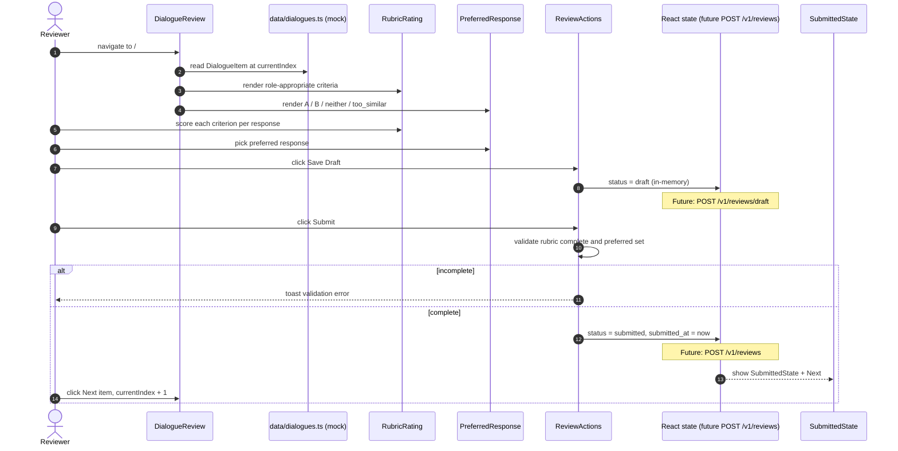
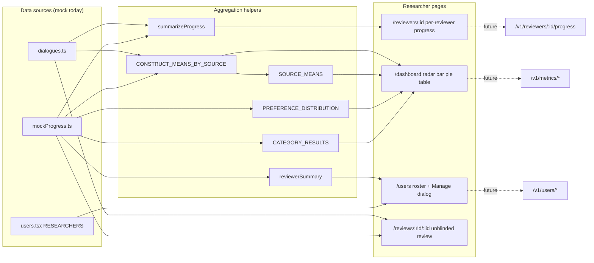
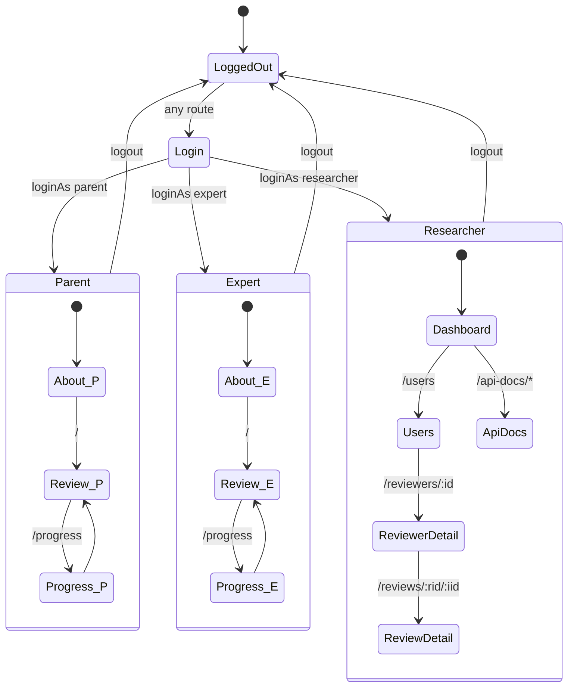
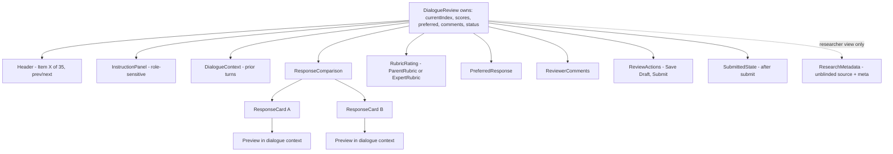

# MIRA — Motivational Interviewing Response Assessment

MIRA is a research review interface for evaluating Motivational Interviewing (MI) dialogue responses. Reviewers are shown a parent concern with two blinded candidate counselor responses (Response A and Response B). Source identity (human interviewer vs Mira) is hidden from reviewers during the task and stored internally for researcher-side analysis. The platform also provides progress tracking for individual reviewers, aggregate analytics across the full reviewer pool, and researcher-side administration of user accounts.

## Purpose

The project supports the CTSI Mira dialogue review/evaluation workflow, comparing Mira-generated motivational interviewing responses against human-interviewer responses in a blinded study. The interface has three roles:

- **Parent reviewers** — rate each response on a 7-point agreement scale across appropriateness, harm, sense-making, clarity, responsibility, and empathy.
- **Expert reviewers** — answer yes / no / unsure on medical safety, accuracy, and relevance, with optional per-response safety notes.
- **Researchers** — monitor reviewer progress, inter-rater agreement, preferred-response distributions, parent-vs-expert breakdowns, and (post-hoc) source comparisons; administer user accounts.

Reviewers are **not** asked to guess which response is human vs Mira. Source identification is a researcher-only post-hoc analysis, not a reviewer task.

## Pages

Routes are file-based under `src/routes/`. Access is enforced in `AuthGate` (`src/routes/__root.tsx`).

### Public / auth

- **`/login`** — role-picker sign-in. User selects Parent Reviewer, Expert Reviewer, or Researcher/Admin. Mock auth: no password; sets `mira:loggedIn` and `mira:reviewerRole` in localStorage. Redirects to `/about` (parent/expert) or `/dashboard` (researcher).

### Parent / Expert reviewer

- **`/about`** — landing/onboarding page. Explains the 3-step review process, role-specific rubric summary, and embeds an overview video. First page shown post-login for parent/expert reviewers.
- **`/`** — Review screen (`DialogueReview`). One item at a time: parent concern + barrier category, prior dialogue context, side-by-side blinded Response A / Response B, role-appropriate rubric, preferred-response picker, free-text comments, optional "Preview in dialogue context" simulated exchange, Save Draft, Submit.
- **`/progress`** — reviewer's own progress across the 35-item review set: completion count, drafts saved, items grouped by HPV barrier category, paginated item table with status and preferred-response selection.

### Researcher / Admin

- **`/dashboard`** — aggregate research dashboard. Two tabs (Overall Summary, By Parent Concern), reviewer-group filter (All / Parents / Experts), radar and bar charts of construct means by source × reviewer type, preference distribution pie, category results table, mock CSV/JSON exports.
- **`/users`** — full user roster (reviewers + researchers) with filter toggle. Each row has a Manage gear that opens the **Manage User** dialog (edit name, change account type, reset reviews, send password reset, delete account).
- **`/reviewers/$reviewerId`** — per-reviewer progress detail (same shape as `/progress` but for a chosen reviewer).
- **`/reviews/$reviewerId/$itemId`** — researcher view of a single submitted review. Response cards are unblinded (true source visible), full rubric table, reviewer comments, collapsible research metadata (transcript id, turn number, model version, seed).
- **`/api-docs/*`** — in-app REST API documentation with sidebar: Overview, Database Schema (Mermaid ERD), Auth, Account (self-service), Users (admin), Dialogues, Reviews, Progress, Metrics.

### Global (all roles)

- **Edit Account dialog** — accessible from the role badge in the top NavBar. Self-service edit display name, send password reset, reset reviews. Does not expose account deletion (that lives in the researcher-only Manage User dialog).

## Tech Stack

- **Framework**: TanStack Start v1 with React 19 and Vite 7.
- **Routing**: File-based routing in `src/routes/`. Route tree auto-generated to `src/routeTree.gen.ts` — do not edit by hand.
- **Styling**: Tailwind CSS v4 with semantic design tokens in `src/styles.css`.
- **UI**: shadcn/ui components (Radix primitives) under `src/components/ui/`.
- **Charts**: Recharts (used on the dashboard).
- **Diagrams**: Mermaid (rendered in the API Docs schema page).
- **State**: Local React state + localStorage for the mock auth session. All domain data is mocked in `src/data/` — no backend.

## Project Structure

```
src/
  routes/
    __root.tsx                              # Root layout, AuthGate, NavBar, footer
    login.tsx                               # /login
    about.tsx                               # /about
    index.tsx                               # / (Review)
    progress.tsx                            # /progress
    dashboard.tsx                           # /dashboard
    users.tsx                               # /users (+ ManageUserDialog)
    reviewers.$reviewerId.tsx               # /reviewers/:id
    reviews.$reviewerId.$itemId.tsx         # /reviews/:reviewerId/:itemId
    api-docs.tsx                            # /api-docs shell + sidebar
    api-docs.index.tsx                      # /api-docs (Overview)
    api-docs.schema.tsx                     # /api-docs/schema
    api-docs.auth.tsx                       # /api-docs/auth
    api-docs.account.tsx                    # /api-docs/account
    api-docs.users.tsx                      # /api-docs/users
    api-docs.dialogues.tsx                  # /api-docs/dialogues
    api-docs.reviews.tsx                    # /api-docs/reviews
    api-docs.progress.tsx                   # /api-docs/progress
    api-docs.metrics.tsx                    # /api-docs/metrics
  components/
    mira/                                   # Domain components
      NavBar.tsx                            # Top navigation, role-filtered links, account dropdown
      EditAccountDialog.tsx                 # Self-service edit account modal
      Header.tsx                            # Review page header (Item X of 35, prev/next)
      InstructionPanel.tsx                  # Role-sensitive collapsible instructions
      DialogueContext.tsx                   # Prior dialogue turns + simulated exchange preview
      DialogueReview.tsx                    # Review page container + state machine
      ResponseComparison.tsx                # Side-by-side response cards
      ResponseCard.tsx                      # Single response card + "Preview in dialogue context"
      RubricRating.tsx                      # ParentRubric (7-pt Likert) + ExpertRubric (yes/no/unsure + notes)
      PreferredResponse.tsx                 # A / B / neither / too_similar picker
      ReviewerComments.tsx                  # Free-text comments
      ReviewActions.tsx                     # Save Draft / Submit
      SubmittedState.tsx                    # Post-submit confirmation + Next item
      ResearchMetadata.tsx                  # Researcher-only collapsible meta block
      ApiEndpoint.tsx                       # Reusable endpoint doc card
      Mermaid.tsx                           # Client-side Mermaid renderer
    ui/                                     # shadcn/ui primitives
  data/
    dialogues.ts                            # DialogueItem type, 5 authored items, rubric criteria, TOTAL_REVIEW_ITEMS=35
    mockProgress.ts                         # ReviewItemProgress, Reviewer, 16 reviewers, 35 items, aggregate data helpers
    schemaErd.ts                            # Mermaid ERD string for the proposed backend schema
  lib/
    auth.ts                                 # Mock auth (localStorage + event bus), useAuth()
    reviewerRole.ts                         # ReviewerRole type, ROLE_LABEL, useReviewerRole()
  styles.css                                # Tailwind v4 + design tokens
  router.tsx                                # Router setup
```

## Auth Model (mock)

Auth is fully mocked with no network call.

- `loginAs(role)` writes `mira:loggedIn = "1"` and `mira:reviewerRole = <role>` to localStorage and dispatches a `mira:auth-change` event.
- `useAuth()` (`src/lib/auth.ts`) returns `{ isLoggedIn, role }` and subscribes to both the custom event and the browser `storage` event so multi-tab sign-in stays in sync.
- `AuthGate` in `src/routes/__root.tsx` runs on every navigation and enforces role-based access: parent/expert are redirected off researcher-only pages; researchers are redirected off reviewer-only pages; unauthenticated users are always sent to `/login`.

Roles: `parent`, `expert`, `researcher`. There is no separate `admin` role — researcher covers admin actions.

## Data Model (mock)

All domain data lives in `src/data/`.

- **`DialogueItem`** (`dialogues.ts`) — `{ id, reviewSet, barrierCategory, parentConcern, priorDialogue?, responseA, responseB, meta }`. `responseA.source` / `responseB.source` are `"human" | "mira"` and are never rendered in the reviewer UI. `meta` carries `transcriptId`, `turnNumber`, `miraModelVersion`, `generationDate`, `randomizationSeed` — shown to researchers in `ResearchMetadata`.
- **`PARENT_STATEMENTS`** (6 items, 7-point Likert) and **`EXPERT_QUESTIONS`** (3 items, yes/no/unsure) — the two rubric sets.
- **`TOTAL_REVIEW_ITEMS = 35`** — 5 fully authored + 30 procedurally generated in `mockProgress.ts`.
- **`ReviewItemProgress`** (`mockProgress.ts`) — per-item state: `preferred`, `avgA`, `avgB`, `sourceA`, `sourceB`, `status: "completed" | "draft" | "not_started"`.
- **`Reviewer`** — `{ id, name, type: "parent" | "expert", assigned, completed, meanParentScore, expertYesRate }`. 16 reviewers seeded with animal names for anonymity.
- Researcher accounts are declared inline in `src/routes/users.tsx` (`RESEARCHERS`).
- Dashboard aggregates: `CONSTRUCT_MEANS_BY_SOURCE`, `SOURCE_MEANS`, `PREFERENCE_DISTRIBUTION`, `CATEGORY_RESULTS`, plus helpers `summarizeProgress` and `reviewerSummary`.

The in-app **Save Draft** and **Submit** buttons update React state only — nothing persists across a page refresh.

## Development

```bash
bun install
bun run dev      # start dev server
bun run build    # production build
bun run lint     # eslint
```

## How it works



### Sign-in & role routing

Sequence of events from opening the app to landing on the first role-appropriate page.



### Review submission flow

What happens when a Parent or Expert reviewer opens `/`, rates a dialogue, and submits.



### Researcher dashboard data flow

How aggregate views assemble from the mock data (and where a real API would slot in).



### Role-based navigation state

Which routes each role can reach after auth. AuthGate redirects any disallowed access.



### Review page component tree

Composition of `DialogueReview` on `/` — where reviewer state lives and how sub-components fit together.



### From mock to real

- **Auth** — replace `src/lib/auth.ts` with real login: `POST /v1/auth/login` returns a bearer JWT; `useAuth()` reads it from a secure store; `AuthGate` reads role from the token claims.
- **Dialogues** — replace `src/data/dialogues.ts` with a `dialogues` + `responses` table; the Review page fetches the next assignment (`GET /v1/dialogues/next`) instead of indexing a static array.
- **Randomization** — a sampler assigns each reviewer an unseen, order-randomized pair (`assignments.position_shuffle`) so source position can't bias ratings.
- **Draft + submit** — Save Draft POSTs to `/v1/reviews/draft`; Submit POSTs to `/v1/reviews`. Both write to the same `reviews` row, differentiated by `status`.
- **Progress** — `/progress` and `/reviewers/:id` read from `GET /v1/me/progress` and `GET /v1/reviewers/:id/progress`.
- **Dashboard** — reads from `/v1/metrics/*` (overview, preferred-distribution, by-category, by-item, inter-rater-agreement, export) computed from aggregation queries / materialized views. Source comparisons are computed post-hoc from the hidden `responses.source` column.
- **Users admin** — the Manage User dialog on `/users` maps to `PATCH /v1/users/:id`, `POST /v1/users/:id/reset-reviews`, `POST /v1/users/:id/password-reset`, `DELETE /v1/users/:id`.
- **Edit Account** — the self-service dialog in the top nav maps to `PATCH /v1/me/account`, `POST /v1/me/password-reset`, `POST /v1/me/reset-reviews`.

## Data Model (proposed real backend)

The tables below are what a real backend would persist. Sample rows are illustrative JSON, not literal SQL. The authoritative Mermaid ERD lives in `src/data/schemaErd.ts` and is rendered in the app at `/api-docs/schema`.

### `reviewers`
Authenticated raters and researchers. One row per user account.

| column | type | notes |
|---|---|---|
| `id` | uuid (pk) | |
| `email` | text unique | login identity |
| `display_name` | text | shown in researcher views and Edit Account |
| `role` | enum(`parent`,`expert`,`researcher`) | drives route access and rubric type |
| `credentials` | text | e.g. "LCSW, 8 yrs MI" |
| `created_at` | timestamptz | |
| `last_active_at` | timestamptz | |

```json
{ "id": "r_8f2…", "email": "j.doe@uni.edu", "display_name": "J. Doe",
  "role": "expert", "credentials": "LCSW", "last_active_at": "2026-06-08T14:02:11Z" }
```

### `dialogues`
A parent-concern scenario in a specific HPV barrier category. Turns are stored inline as JSON since they're read together.

| column | type | notes |
|---|---|---|
| `id` | text (pk) | e.g. `MIRA-014` |
| `review_set` | text | "Pilot Set A" |
| `barrier_category` | enum | one of the 5 HPV barrier categories |
| `parent_concern` | text | the parent's stated concern |
| `turns` | jsonb | `[{ "speaker": "parent" \| "clinician", "text": "…" }]` |
| `transcript_id` | text | source transcript reference |
| `turn_number` | int | which turn in the source transcript |
| `mira_model_version` | text | e.g. `mira-v0.4.1` |
| `generation_date` | date | when the MIRA response was generated |
| `randomization_seed` | int | seed used for A/B shuffle |
| `created_at` | timestamptz | |

### `responses`
Two candidate counselor responses per dialogue. `source` is ground truth; never returned to reviewers.

| column | type | notes |
|---|---|---|
| `id` | uuid (pk) | |
| `dialogue_id` | fk → dialogues | |
| `body` | text | response body |
| `source` | enum(`human`,`mira`) | hidden from reviewers; researcher-only |
| `model_name` | text null | e.g. `mira-v0.4.1`, null if human |
| `author_id` | uuid null | fk → clinicians, null if Mira-generated |

The A/B *label* shown to a reviewer is derived per assignment from `assignments.position_shuffle`, not stored on the response.

### `assignments`
Which dialogues are queued for which reviewer, and how A/B were shuffled.

| column | type | notes |
|---|---|---|
| `id` | uuid (pk) | |
| `reviewer_id` | fk | |
| `dialogue_id` | fk | |
| `position_shuffle` | bool | `true` = response B shown as A |
| `assigned_at` | timestamptz | |
| `due_at` | timestamptz null | |

### `reviews`
One row per assignment. Rubric scores live in a child table. Reviewers do not submit source guesses.

| column | type | notes |
|---|---|---|
| `id` | uuid (pk) | |
| `assignment_id` | fk unique | |
| `role` | enum(`parent`,`expert`) | which rubric was used |
| `status` | enum(`draft`,`submitted`) | Save Draft writes `draft`; Submit writes `submitted` |
| `preferred` | enum(`A`,`B`,`neither`,`too_similar`) null | required on submit, optional on draft |
| `comments` | text | free-text |
| `expert_notes_a` | text null | safety notes for A (expert role only) |
| `expert_notes_b` | text null | safety notes for B (expert role only) |
| `submitted_at` | timestamptz null | set when status transitions to `submitted` |
| `updated_at` | timestamptz | last modification |

### `rubric_scores`
Per-criterion score for each response within a review. Parent rows use `score_1_to_7`; expert rows use `expert_answer`.

| column | type | notes |
|---|---|---|
| `id` | uuid (pk) | |
| `review_id` | fk | |
| `response_label` | enum(`A`,`B`) | label as shown to this reviewer |
| `criterion` | text | fk → rubric_criteria.name |
| `score_1_to_7` | int (1–7) null | parent agreement score |
| `expert_answer` | enum(`yes`,`no`,`unsure`) null | expert binary judgment |

### `rubric_criteria`
Editable list of rubric items so researchers can revise without a deploy. The `type` column enforces that parent statements are only scored by parents and expert questions only by experts.

| column | type | notes |
|---|---|---|
| `name` | text (pk) | e.g. "This response shows empathy." |
| `type` | enum(`parent`,`expert`) | which rubric this criterion belongs to |
| `description` | text | |
| `display_order` | int | |
| `active` | bool | |

### `audit_log`
Append-only trail of admin actions (rename, role change, password reset, review reset, account deletion) and review re-opens. Powered by the Manage User dialog on `/users` and the Edit Account dialog in the top nav.

```json
{ "actor_id": "r_admin", "action": "user.reset_reviews",
  "entity": "reviewers", "entity_id": "r_8f2…", "at": "2026-06-03T10:00:00Z",
  "meta": { "reviews_deleted": 8, "drafts_deleted": 2 } }
```

### `simulated_exchanges`
Optional record of the in-app **"Preview in dialogue context"** action. When a reviewer previews a response, the chosen response is shown alongside a simulated parent reply. Only the most recent preview per (reviewer, dialogue) is kept. Research-only; **not** part of the formal review.

| column | type | notes |
|---|---|---|
| `id` | uuid (pk) | |
| `reviewer_id` | fk → reviewers | |
| `dialogue_id` | fk → dialogues | |
| `sent_response_id` | fk → responses | which candidate was previewed |
| `sent_label` | enum(`A`,`B`) | label as shown to this reviewer (post-shuffle) |
| `simulated_parent_reply` | text | template- or model-generated parent turn (no live AI in the prototype) |
| `generator` | text | e.g. `template-v1` |
| `created_at` | timestamptz | |

### Randomization & assignment rules

- **Unseen sampling**: each reviewer only ever gets dialogues they haven't reviewed.
- **A/B position shuffle**: `assignments.position_shuffle` randomizes which response appears as A vs B so source position can't bias ratings.
- **Balanced source mix**: the sampler tries to keep ~50/50 human-A vs human-B across each reviewer's queue. Source identity is hidden from reviewers.
- **Overlap dialogues**: a configurable subset is assigned to every reviewer so inter-rater agreement can be computed.
- **Simulated exchanges**: excluded from rubric scoring and aggregate review metrics.

### Prototype boundary

This prototype demonstrates the MIRA dialogue review workflow only. It does not include live AI generation, chatbot interaction, real transcripts, real authentication, or production data storage. The "Preview in dialogue context" panel uses canned parent replies and is purely illustrative. Password reset, review reset, and account deletion in both the Edit Account and Manage User dialogs show a toast but do not persist any change.

See the in-app **API Docs** section (`/api-docs`) for the full endpoint surface that would back these tables.

## Notes

- No backend is wired up; all reviewer/dialogue data is mock data for design and prototyping.
- Routes are auto-registered by the TanStack Router Vite plugin — do not edit `src/routeTree.gen.ts` by hand.
- The Progress Tracker intentionally surfaces completed rows first so the design team can preview the populated state.
