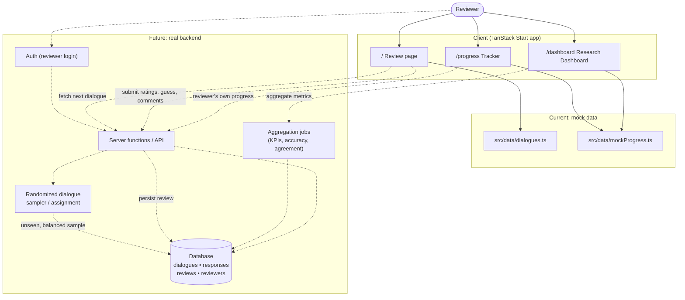

# MIRA — Motivational Interviewing Response Assessment

MIRA is a research review interface for evaluating Motivational Interviewing (MI) dialogue responses. Reviewers are shown a client utterance with two candidate counselor responses (one human-authored, one AI-generated), and asked to compare, rate, and annotate them across multiple rubric criteria. The platform also provides progress tracking for individual reviewers and aggregate analytics across the full reviewer pool.

## Purpose

The project supports a research study comparing human- and AI-generated counselor responses in motivational interviewing dialogues. The interface is designed for:

- **Reviewers** — clinicians or trained raters who score 100+ dialogue comparisons.
- **Researchers** — study leads who monitor reviewer progress, inter-rater agreement, and human-vs-AI identification accuracy.

## Pages

### `/` — Review
The main scoring screen for a single dialogue comparison.
- Conversation context with the prompting client utterance.
- Two side-by-side response cards (Response A / Response B):
  - "Select stronger response" button.
  - Human / AI source-guess buttons (reviewer guesses which response is human-authored).
- Rubric ratings for each response across multiple MI criteria.
- Free-text reviewer comments.
- Submit / navigate between dialogues.

### `/progress` — Progress Tracker
Personal progress view for an individual reviewer.
- Overall progress bar and summary stats (completed count, average grades, Human-vs-AI identification accuracy, picked-Human vs picked-AI ratio).
- Paged table of 10 dialogue scenarios per page showing:
  - Completion status (green check vs grey checkbox).
  - Which response was selected as stronger (A/B).
  - Average grades for A and B.
  - Source-guess correctness chips for A and B.
- Completed scenarios are surfaced first. Rows are clickable and route to the Review page.

### `/dashboard` — Research Dashboard
Aggregate metrics across all reviewers (e.g. 20 reviewers × 100 comparisons).
- KPI cards: total reviewers, completion rate, mean rubric scores, Human-vs-AI identification accuracy.
- Charts: per-reviewer completion, per-reviewer source-identification accuracy, distribution of stronger-response selections by true source.
- Reviewer leaderboard with anonymized reviewer names, completion, average scores, source accuracy, and Human/AI pick counts.

## Tech Stack

- **Framework**: TanStack Start (v1) with React 19 and Vite 7.
- **Routing**: File-based routing in `src/routes/` (`__root.tsx`, `index.tsx`, `progress.tsx`, `dashboard.tsx`).
- **Styling**: Tailwind CSS v4 with semantic design tokens defined in `src/styles.css`.
- **UI**: shadcn/ui components (Radix primitives) under `src/components/ui/`.
- **Charts**: Recharts (used on the dashboard).
- **State**: Local React state; mock data only — no backend.

## Project Structure

```
src/
  routes/
    __root.tsx          # Root layout, includes top NavBar + Outlet
    index.tsx           # Review page (/)
    progress.tsx        # Progress Tracker (/progress)
    dashboard.tsx       # Research Dashboard (/dashboard)
  components/
    mira/               # Domain components
      NavBar.tsx              # Top navigation across the three pages
      Header.tsx              # Review page header
      DialogueContext.tsx     # Client utterance context block
      DialogueReview.tsx      # Review page container + state
      ResponseComparison.tsx  # Side-by-side response cards
      ResponseCard.tsx        # Single response card + Human/AI guess
      RubricRating.tsx        # Per-criterion rating controls
      ReviewerComments.tsx    # Free-text comments
      ReviewActions.tsx       # Submit / navigation actions
      ResearchMetadata.tsx
      SubmittedState.tsx
    ui/                 # shadcn/ui primitives
  data/
    dialogues.ts        # Mock dialogue scenarios + rubric criteria
    mockProgress.ts     # Mock per-reviewer progress + aggregate data
  styles.css            # Tailwind v4 + design tokens
  router.tsx            # Router setup
```

## Data Model (mock)

All data is currently mocked in `src/data/`. Key shapes:

- **Dialogue** — client utterance + two candidate responses (A/B) + rubric criteria.
- **DialogueProgress** — per-dialogue review state: completion, selected stronger response, average grades, true source (A/B = human/ai), and reviewer source guesses.
- **Reviewer** — anonymized reviewer with derived metrics: completion %, average grade, source-identification accuracy, picked-human / picked-ai counts.

Helpers `summarizeProgress` and `reviewerAverages` compute the aggregates rendered on the Progress Tracker and Research Dashboard.

## Development

```bash
bun install
bun run dev      # start dev server
bun run build    # production build
bun run lint     # eslint
```

## How it works

The diagram below shows the current mock-data flow (solid lines) alongside how the same flow would operate when wired to a real backend with authenticated users and a randomized dialogue queue (dashed lines).



### From mock to real

- **Dialogues** — replace `src/data/dialogues.ts` with a `dialogues` + `responses` table; the Review page fetches the next assignment via a server function instead of indexing a static array.
- **Randomization** — a sampler assigns each reviewer an unseen, order-randomized pair (Response A/B shuffled per view) so source position can't bias ratings.
- **Users** — add authentication so each reviewer has an identity; reviews are written with `reviewer_id` and progress/dashboard queries scope to the logged-in user (or aggregate across all reviewers for researchers).
- **Submissions** — `ReviewActions` "Submit" calls a server function that writes a `reviews` row (ratings, stronger-response choice, source guess, comments) instead of local component state.
- **Analytics** — the Research Dashboard reads from aggregation queries/materialized views (completion %, source-ID accuracy, stronger-response distribution, inter-rater agreement) instead of `summarizeProgress` over mock arrays.

## Notes

- No backend is wired up; all reviewer/dialogue data is mock data for design and prototyping.
- Routes are auto-registered by the TanStack Router Vite plugin — do not edit `src/routeTree.gen.ts` by hand.
- The Progress Tracker intentionally surfaces completed rows first so the design team can preview the populated state.

